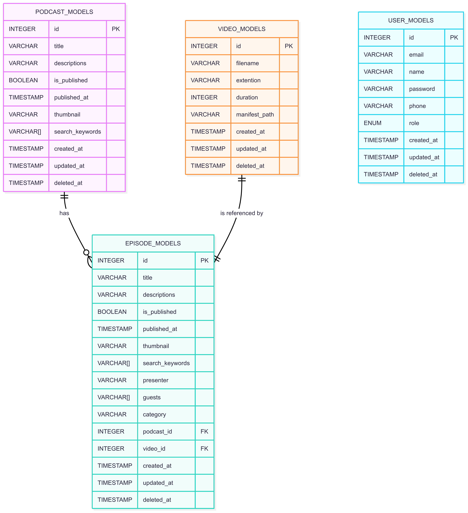

# 🎙️ Podcast Backend – thamanyah-task

Backend system for managing podcasts, episodes, video uploads, and HLS streaming.

> Built with NestJS, tus.io for resumable uploads, Sequelize ORM, FFmpeg for video processing, and BullMQ for queuing.

[](LICENSE)
[](https://github.com/Yassen-Higazi/8-task/stargazers)

---

## 🚀 Tech Stack

- **Framework**: NestJS
- **Database**: PostgreSQL + Sequelize ORM
- **Authentication**: JWT
- **Uploads**: tus.io resumable uploads (`@tus/server`)
- **Video Processing**: FFmpeg (HLS + fallback MP4)
- **Queue**: BullMQ + Redis + BullDashboard (`/queues`)
- **Search**: Elasticsearch
- **Context**: `nestjs-cls`
- **Docs**: Swagger + Compodoc

---

## 📦 Features

- Podcast + episode management
- Resumable tus.io uploads
- HLS + MP4 video processing
- Multi-quality streaming (360p, 480p, 720p + fallback 480p MP4)
- BullMQ queue system with dashboard
- Elasticsearch-powered discovery
- Pagination + structured APIs
- Code docs with Compodoc

---

## 📁 Project Structure

```txt
src/
├── app.module.ts
├── main.ts
├── auth/             # JWT auth and user management
├── cms/              # Podcast, episode, upload handling
│   ├── controllers/
│   ├── dtos/
│   ├── models/
│   ├── repositories/
│   ├── services/
│   └── video.processor.ts
├── configs/          # DB, Elastic, constants
├── discovery/        # Elasticsearch search logic
├── queues/           # BullMQ queues (video transcoding)
├── shared/           # Interceptors, decorators, helpers
```

---

## 🐳 Docker Setup

```bash
# Clone
git clone https://github.com/Yassen-Higazi/8-task.git
cd thamanyah-task

cp .env.example .env

# Start all services
docker compose up --build

# Access:
# - NestJS:         http://localhost:3000
# - Swagger:        http://localhost:3000/api
# - Compodoc:       http://localhost:8080
# - Bull Dashboard: http://localhost:3000/queues
# - Kibana:         http://localhost:5601
```

---

## 📂 Upload & Video Processing

### Upload Flow

```
POST /files
```

- Resumable via tus.io
- Stored as: `uploads/<podcastId>/<episodeId>/video.mp4`

### HLS & Fallback

- Resolutions: `360p`, `480p`, `720p` + fallback `480p.mp4`
- FFmpeg job is queued using BullMQ
- Output location:

```
uploads/podcasts/<podcastId>/<episodeId>/
├── manifest.m3u8
├── 360p.m3u8
├── 480p.m3u8
├── 720p.m3u8
├── fallback.mp4
```

### Accessing HLS

```
GET /static/podcasts/:podcastId/:episodeId/manifest.m3u8
```

---

## 🔍 Discovery Search

Search endpoint:

```
GET /discovery/search/searchPodcasts?searchTerm=""
```

Supports filters and full-text indexing using Elasticsearch.

---

## 📊 Pagination

Query parameters:

| Param         | Type   | Default | Min | Max | Description                |
| ------------- | ------ | ------- | --- | --- | -------------------------- |
| `page_size`   | number | `20`    | 5   | 50  | Number of items per page   |
| `page_number` | number | `1`     | 1   | —   | Page index (starts from 1) |

### Response

```json
{
  "rows": [...],
  "count": 95,
  "pagination": {
    "pageSize": 20,
    "pageNumber": 1,
    "totalPages": 5,
    "nextPage": 2,
    "previousPage": 1
  }
}
```

---

## 📘 API & Code Docs

### Swagger

```
http://localhost:3000/api
```

### Compodoc

```
http://localhost:8080
```

To generate docs:

```bash
npm run docs
```

---

## 📌 Environment Setup

Use the provided `.env.example` as a starting point:

```bash
cp .env.example .env
```

---

## 🛠️ Scripts

```bash
npm run start:dev      # Start dev server
npm run build          # Build app
npm run lint           # Lint code
npm run docs           # Generate Compodoc
```

---

## Database Structure


